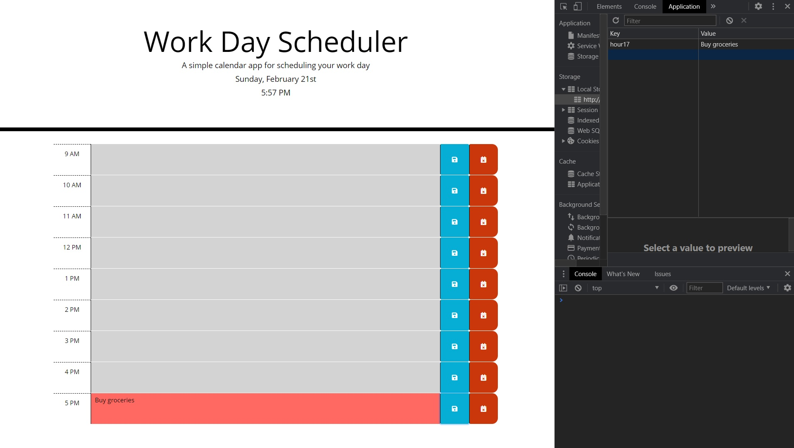
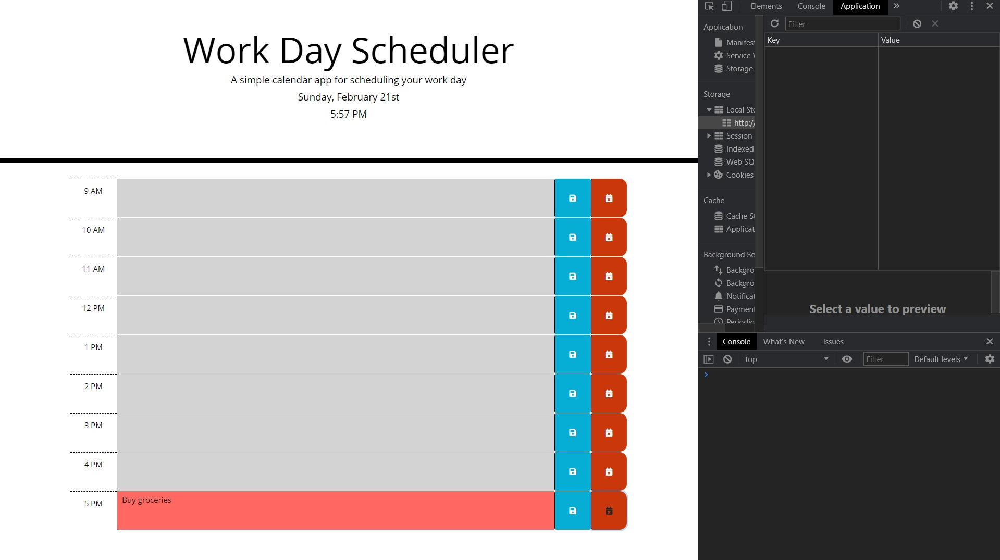

# **Work Day Scheduler**

## Table of Contents

* [Description](#description)
* [Requirements](#requirements)
* [Installation](#installation)

## Description
---

This is a Work Day Calender where you can put information in each hour of a work day and it will still be there after your refresh the page. If you click on clear on any of the selected hour, it will clear the information.

Deployed Project: https://erenozgur98.github.io/work-day-scheduler/

---

In this picture you can see it saves the information inside the text are to the local storage.



Here you can see after you press clear button it clears the information inside local storage for this hour only.




## Requirements
---
```md
GIVEN I am using a daily planner to create a schedule
WHEN I open the planner
THEN the current day is displayed at the top of the calendar
WHEN I scroll down
THEN I am presented with timeblocks for standard business hours
WHEN I view the timeblocks for that day
THEN each timeblock is color coded to indicate whether it is in the past, present, or future
WHEN I click into a timeblock
THEN I can enter an event
WHEN I click the save button for that timeblock
THEN the text for that event is saved in local storage
WHEN I refresh the page
THEN the saved events persist
```

## Installation
---
No need for any installation for this project. It can be used in the website.

See deployed site here: https://erenozgur98.github.io/work-day-scheduler/

See repository here: https://github.com/erenozgur98/work-day-scheduler
